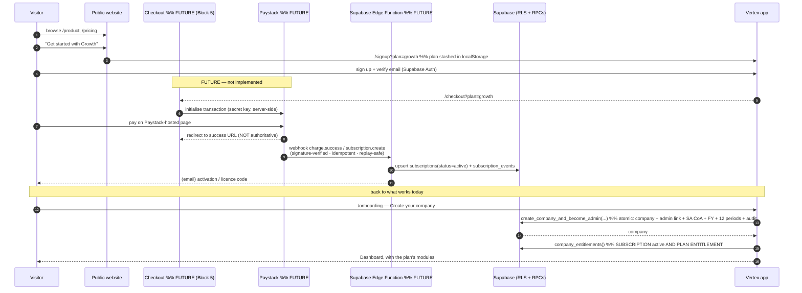

# Commercial Onboarding — Vertex Accounting

The end-to-end journey from public website to a working accounting
workspace, and the two ways a colleague joins an existing company.

- Payment provider: **Paystack** (ZAR / South Africa) — **selected,
  integration pending merchant credentials**.
- Server runtime: **Supabase Edge Functions** — the trusted boundary for
  Paystack webhook verification, subscription activation, activation /
  licence codes and invitation email. **Not built yet.**
- **No payments are processed. No real user is marked paid.**

See also: `docs/SUBSCRIPTIONS.md`, `docs/PLAN_ENTITLEMENTS.md`,
`docs/SECURITY.md`, `docs/SEO.md`, `docs/KNOWN_ISSUES.md` (migrations
0066–0069).

## Status by stage

| Stage | State | Where |
|---|---|---|
| Public website + pricing | ✅ live | `src/features/marketing/*`, `Pricing.tsx` renders from `PLAN_CATALOGUE` (DB mirror) |
| Plan selection → carry into signup | ✅ | "Get started with {plan}" → `/signup?plan={code}` → stashed in `localStorage` |
| Checkout page | ⏳ FUTURE (Block 5) | — |
| Paystack payment | ⏳ FUTURE | — |
| Server-side payment verification (webhook) | ⏳ FUTURE | Supabase Edge Function |
| Verified subscription | ⚙️ model ready | `subscriptions` / `subscription_events` (0068); activated by the Edge Function |
| Activation / licence code | ⏳ FUTURE | Edge Function |
| Account (sign up + verify email) | ✅ live | Supabase Auth, `/signup` |
| **First company creation** | ✅ **fixed (0066/0067)** | `create_company_and_become_admin` — atomic, seeds SA CoA + FY + 12 periods, no orphans |
| Company onboarding wizard | ✅ live | `/onboarding` — multi-section "Create your company" |
| Existing-company: add a user | ✅ live | `/admin/users` → **Add user** (two flows below) |
| Plan entitlements | ✅ live (0068) | `useEntitlement`, `<EntitlementGate>`, server `require_entitlement()` scaffold |
| Subscription management | ✅ basic | `/settings/subscription` (Plan & Billing) |

## Flow 1 — Plan → Subscription → Company (the target journey)



The browser is **never** authoritative for payment success, plan
identity, amount paid or entitlements — only the signature-verified
server-side webhook is. Raw card details are never stored or transmitted
by Vertex (Paystack-hosted checkout).

## Flow 2 — Admin adds a colleague to an existing company

Two honest paths, both from `/admin/users` → **Add user**:

```mermaid
sequenceDiagram
  autonumber
  participant Ad as Company admin
  participant App as Vertex app
  participant DB as Supabase (SECURITY DEFINER RPCs + RLS)
  participant Col as Colleague

  alt FLOW A — colleague ALREADY has a Vertex account (companyless)
    Ad->>App: Add user → "They use Vertex" → exact email
    App->>DB: find_unassigned_profile_by_email(email)   %% 0014 — admin-only, exact match
    DB-->>App: the one unassigned profile (or none)
    Ad->>App: "Add to company"
    App->>DB: add_existing_user_to_company(user_id, company_id)   %% 0065 — atomic, concurrency-safe, audited
    DB-->>App: ASSIGNED
    Ad->>App: set access level + fine-grained role
  else FLOW B — the email has NOT registered yet
    Ad->>App: Add user → "Invite by email" → email + access level (+ role)
    App->>DB: create_company_invitation(email, role, role_id?)   %% 0069
    DB-->>App: { token (once), accept link, email_sent: false }
    Note over App: NO email infra — the dialog shows the link to COPY;<br/>says "Invitation created", never "Email sent"
    Ad->>Col: sends the /accept-invite?token=… link
    Col->>App: opens link → sign up + verify email (same address)
    Col->>App: "Accept & join"
    App->>DB: accept_company_invitation(token)   %% single-use · time-limited · company- & email-bound
    DB->>DB: link profile (scoped trigger bypass) + optional user_roles + mark accepted + audit
    DB-->>App: JOINED (with the pre-approved access level)
    App-->>Col: Dashboard
  end
```

### Invitation security (migration 0069)

- Token generated server-side (`gen_random_bytes(32)`), **only its SHA-256
  hash is stored**, returned to the admin exactly once.
- **Single-use** (status → `accepted`), **time-limited** (7 days),
  **company-bound**, **email-bound** (acceptance requires the caller's own
  verified `auth.users.email` to match).
- `create_company_invitation` is **admin-only** and **never reveals**
  whether an email already has an account — no user directory, no wildcard
  search.
- The scoped profile bypass (`vertex.invitation_company_id` GUC, mirroring
  0066's bootstrap one) permits **exactly** the caller's own companyless
  `viewer` row → a non-superuser access level, into the invited company,
  and **only while a matching pending unexpired invitation exists**. It can
  never grant superuser, move an existing member, or touch another user.
- Revocable (`revoke_company_invitation`), listed for the admin
  (`/admin/users` → Pending invitations).

## Roles a company can assign

**Access level** (`profiles.role`, drives RLS): `admin`, `accountant`,
`manager`, `operator`, `viewer`. **Fine-grained roles** (drive
`useCanAccess()`): the 6 system roles — `accountant`, `finance_manager`,
`sales_manager`, `stock_controller`, `employee`, `viewer` — plus any custom
role the company creates.

> **Product decision needed — "Bookkeeper" role.** The brief's example UX
> lists a *Bookkeeper* option. **No `bookkeeper` role exists** (system or
> custom) and it has **not** been silently mapped to `accountant`. Options:
> (a) add a `bookkeeper` system role via migration with its own permission
> grants; (b) treat it as a company-created custom role; (c) drop the label
> and use `accountant`. This is a business call, not an implementation
> detail.

## Downgrade / cancellation — accounting is never destroyed

A plan change only changes what's available **going forward**. All
transactions, journals, documents, stock movements and audit records stay
exactly as they are; a lost module's routes show an upgrade prompt and its
writes are rejected server-side. Proven live (rollback-wrapped) —
`docs/PLAN_ENTITLEMENTS.md` § Downgrade safety.
