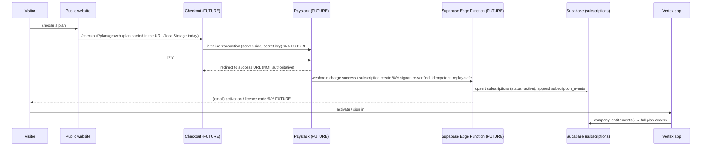

# Subscriptions — Vertex Accounting (platform billing)

Billing for **Vertex itself**, not a customer's accounting. Kept entirely
separate from the ledger — no journal entries, no GL accounts, no Trial
Balance effect. See `docs/PLAN_ENTITLEMENTS.md` for how a subscription
feeds Layer 1 + Layer 2 of the access model.

## Provider & runtime

| | Choice | State |
|---|---|---|
| Payment provider | **Paystack** (ZAR, South Africa) | selected — **integration pending merchant credentials (Block 5)** |
| Server runtime | **Supabase Edge Functions** | the trusted boundary for webhook verification, subscription activation, activation/licence codes and invitation email — **not built yet** |

**No payment code, keys, webhook secrets or "paid" flags exist yet.**
Nothing marks a real user paid.

## Data model (migration 0068)

| Table | Purpose |
|---|---|
| `subscription_features` | entitlement catalogue — 22 keys, `is_core` flag (`anon`-readable) |
| `subscription_plans` | Starter / Growth / Premium — code, name, `price_cents` (ZAR ex-VAT), `included_users`, `is_active`, `is_public` (`anon`-readable) |
| `plan_features` | which features each plan unlocks (`anon`-readable) |
| `subscriptions` | 0..1 per company — `plan_id`, `status`, `provider`, `provider_reference`, period dates, `activated_at`, `cancelled_at`. RLS: read own company (or superuser); write superuser-only (the Edge Function uses `service_role`) |
| `subscription_events` | append-only audit — `event_type` (`created`/`activated`/`plan_changed`/`past_due`/`suspended`/`reactivated`/`cancelled`/`expired`), `detail` jsonb. Same RLS |

`subscription_status` enum: `pending`, `trialing`, `active`, `past_due`,
`suspended`, `cancelled`, `expired`.

## Lifecycle (the parts that exist today)

```
company has NO subscriptions row      → "unmanaged" → fully entitled (grandfathered / legacy)
row, status = active | trialing       → the plan's features (+ core)
row, status = past_due | suspended    → core features only  (Layer 1 lapses)
row, status = cancelled | expired     → core features only
```

`current_period_*`, `activated_at`, `cancelled_at` are populated by the
Paystack webhook Edge Function once it exists.

## FUTURE — pending Paystack (Block 5)



Everything marked **FUTURE** is not implemented. The browser is **never**
authoritative for payment success, plan identity, amount or entitlements —
only the signature-verified server-side webhook is. Raw card details are
never stored or transmitted by Vertex (Paystack-hosted checkout).

## What is wired today

- `subscriptionService.getCompanySnapshot()` → `company_entitlements()` RPC
  + the `subscriptions` row → `entitlementStore` (via `EntitlementsLoader`
  in `AppLayout`).
- `/settings/subscription` (**Plan & Billing** nav item) — current plan,
  status, what it unlocks, and a plan comparison. "Checkout coming soon"
  buttons; honest "not on a managed plan" state for unmanaged companies.
- The public pricing page (`Pricing.tsx`) renders from `PLAN_CATALOGUE`
  (the DB mirror). "Get started with {plan}" → `/signup?plan={code}`;
  `SignUpPage` stashes the plan in `localStorage` for the future checkout.

## Superuser / support

A superuser bypasses Layers 1 and 2 (explicit, and `subscriptions` /
`subscription_events` writes are superuser-only in RLS). Manual plan
changes by support are auditable via `subscription_events`.
